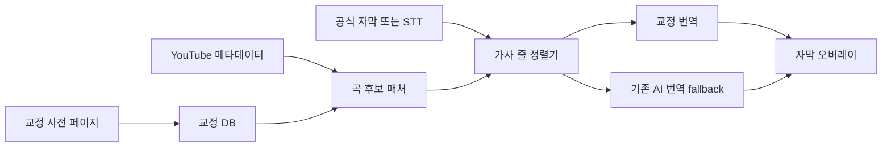

# 곡별 교정 사전 구현 계획

## 1. 목표

사용자가 곡 이름, 가수/작곡가, 원문 가사와 교정 번역을 직접 등록하고 YouTube에서 같은 곡이나 커버곡을 재생할 때 교정문을 우선 자막으로 사용한다.

핵심 원칙:

- 교정 데이터는 사용자 컴퓨터에만 저장한다.
- 공식 자막이나 STT에서 실제 원문을 확인한 뒤 교정을 적용한다.
- 제목만 같다는 이유로 교정문을 강제 표시하지 않는다.
- 커버곡에서는 원곡 교정을 재사용하되 편곡, 반복, 생략, 개사와 대화를 분리한다.
- 교정 기능은 영상 레이아웃, 전체화면, 탭 오디오 캡처를 변경하지 않는다.

## 2. 사용자 경험

### 팝업

팝업은 빠른 명령만 제공한다.

- `교정 사전 열기`
- `현재 곡 등록`
- `교정 적용` 토글
- 현재 상태: `교정 없음`, `곡 후보 확인`, `원문 매칭 중`, `교정 적용 중`

### 교정 사전 관리 페이지

확장프로그램 내부의 독립된 전체 페이지 `corrections.html`을 새 탭으로 연다. 별도 데스크톱 프로그램은 만들지 않는다.

```text
┌────────────────────────────────────────────────────────────┐
│ 교정 사전     [현재 YouTube 영상 가져오기] [가져오기]     │
├──────────────┬─────────────────────────────────────────────┤
│ 곡 목록      │ 곡 정보                                    │
│ 검색         │ 제목 / 가수 / 작곡가 / 원문 언어 / 길이    │
│              │ YouTube 영상 ID / 별칭 / 원곡 연결         │
│ Song A       ├─────────────────────────────────────────────┤
│ Song B       │ 원문 가사              사용자 교정 번역    │
│ Song C       │ 届いたテレパシー        전해진 텔레파시    │
│              │ やっと会えた            드디어 만났어      │
├──────────────┴─────────────────────────────────────────────┤
│ [줄 추가] [LRC/SRT/JSON 가져오기] [미리보기] [저장]       │
└────────────────────────────────────────────────────────────┘
```

편집 지원:

- 줄 단위 추가, 수정, 삭제와 순서 이동
- 원문과 번역을 나란히 표시
- `.lrc`, `.srt`, `.json` 가져오기
- JSON 내보내기와 백업 복원
- 현재 YouTube 영상의 제목, 채널, 길이, 영상 ID 자동 채우기
- 저장 전에 중복 곡과 비어 있는 번역 표시
- 현재 영상에서 적용될 결과 미리보기

## 3. 데이터 모델

교정 사전은 일반 `TranslatorSettings`와 분리한다. 설정 변경 알림이나 STT 재구성을 유발하지 않도록 IndexedDB의 별도 저장소에서 관리한다.

```ts
type SongCorrection = {
  id: string;
  title: string;
  artist: string;
  composer?: string;
  aliases: string[];
  sourceLanguage: string;
  targetLanguage: string;
  durationSeconds?: number;
  videoIds: string[];
  lines: CorrectionLine[];
  variants: CoverVariant[];
  enabled: boolean;
  version: number;
  createdAt: number;
  updatedAt: number;
};

type CorrectionLine = {
  id: string;
  source: string;
  translation: string;
  startMs?: number;
  endMs?: number;
  note?: string;
};

type CoverVariant = {
  id: string;
  name: string;
  videoIds: string[];
  performer?: string;
  durationSeconds?: number;
  lineOverrides: Array<{
    baseLineId?: string;
    source: string;
    translation: string;
  }>;
};
```

저장 시 정규화한 검색 필드와 원문 해시를 별도로 생성하되, 사용자가 입력한 원문은 수정하지 않고 보존한다.

## 4. 곡 식별

곡 후보 점수:

1. 현재 YouTube 영상 ID가 등록된 ID와 일치
2. 제목과 곡 별칭이 일치
3. 채널/가수 이름이 일치
4. 영상 길이 차이가 허용 범위 안에 있음
5. 실제 공식 자막 또는 STT가 저장 원문과 연속으로 일치

적용 규칙:

- 영상 ID 일치는 강한 후보 선택 신호이지만 실제 원문 확인은 계속한다.
- 메타데이터만 일치할 때는 원문 2줄 연속 매칭 후 교정을 활성화한다.
- 동명곡, 메들리, 라이브 잡담에서는 원문 매칭이 없으면 교정을 적용하지 않는다.
- 영상 전환 시 이전 곡의 후보, 커서, 번역 응답을 즉시 폐기한다.

## 5. 자막 적용 순서

```text
현재 영상과 곡 후보 식별
  → 공식 자막 또는 STT 원문 확보
  → 커버별 교정 원문 매칭
  → 원곡 교정 원문 매칭
  → 검색 가사 문맥 보조
  → LM Studio/API 번역
```

최종 우선순위:

1. 현재 커버 영상에 등록된 교정 번역
2. 원곡 교정 사전의 정확히 일치하는 줄
3. 검색 가사와 높은 확률로 일치한 AI 번역
4. 기존 공식 자막 번역
5. 기존 STT 번역

교정문이 적용되더라도 원문 표시 옵션과 기존 환각 차단 규칙은 유지한다.

## 6. 커버곡 처리

원곡의 번역문과 시간 정보를 커버에 그대로 재생하지 않는다.

- 같은 원문 줄: 원곡 교정 번역 재사용
- 반복 후렴: 현재 인식 순서에 맞춰 같은 교정문 재사용
- 생략 구간: 현재 원문이 나타나지 않으면 건너뜀
- 개사 구간: 커버별 교정이 있으면 우선 적용
- 등록되지 않은 개사: 원곡 교정을 문맥으로만 제공하고 AI가 현재 원문을 번역
- 애드리브와 일반 대화: 교정 모드를 잠시 해제하고 기존 실시간 번역 사용
- 노래가 다시 시작되고 원문이 연속 매칭되면 교정 모드로 복귀

시간 정보가 있는 커버 전용 LRC는 빠른 동기화에 사용한다. 시간 정보가 없으면 공식 자막 또는 STT와 순차 정렬한다.

## 7. 런타임 분리



역할 분리:

- content script: 현재 영상 ID와 원문 세그먼트 전달, 결과 표시
- background: 후보 선택, 줄 정렬, 교정 우선순위 결정
- correction DB: CRUD, 가져오기/내보내기, 버전 관리
- offscreen/STT: 기존 오디오 처리만 담당하며 교정 DB를 직접 읽지 않음
- popup/options: 페이지 열기와 활성화 상태만 변경

이 분리로 교정 저장이나 편집이 오디오 캡처 재시작과 전체화면 배치에 영향을 주지 않게 한다.

## 8. 피드백과 확인 기능

사용자가 잘못 적용된 이유를 확인할 수 있도록 다음 정보만 간단히 제공한다.

- 선택된 곡과 커버 프로필
- 선택 근거: 영상 ID, 제목/가수, 길이, 원문 일치
- 현재 원문과 매칭된 교정 줄
- 적용 출처: `사용자 교정`, `커버 교정`, `AI 번역`
- `이 줄 수정`, `이 영상에만 적용`, `이 매칭 해제` 명령

디버그 세부 점수는 기본 화면에 노출하지 않고 교정 페이지의 진단 보기에서만 확인한다.

## 9. 파일 구성

예상 추가 파일:

```text
corrections.html
src/corrections/index.ts
src/corrections/style.css
src/shared/corrections.ts
src/background/correctionStore.ts
src/background/correctionMatcher.ts
```

예상 수정 파일:

```text
vite.config.ts
public/manifest.json
src/shared/messages.ts
src/background/index.ts
src/content/index.ts
src/popup/index.ts
tests/layout-audio-contract.test.mjs
```

## 10. 구현 단계

### 1단계: 로컬 교정 사전

- CRUD 관리 페이지
- 현재 영상 정보 가져오기
- 줄 단위 직접 입력
- JSON 가져오기/내보내기
- 영상 ID와 제목/가수 기반 후보 선택

### 2단계: 공식 자막 적용

- 공식 자막 원문과 교정 줄 정렬
- 교정 번역 우선 표시
- 영상 이동과 탐색 위치 변경 복구
- 적용 출처 표시

### 3단계: STT와 커버곡

- STT 원문 연속 매칭
- 원곡과 커버 프로필 상속
- 반복, 생략, 개사, 애드리브 전환
- 라이브 노래와 일반 대화 자동 전환

### 4단계: 편집 피드백

- 오버레이에서 현재 줄 교정 페이지 열기
- 이 영상 전용 수정
- 잘못된 매칭 해제와 되돌리기
- 가져오기 데이터 검증과 충돌 해결

## 11. 테스트 기준

- 등록된 영상 ID에서 올바른 곡을 선택한다.
- 같은 제목의 다른 곡에는 교정을 적용하지 않는다.
- 공식 자막이 있는 원곡에서 줄별 교정 번역이 즉시 나온다.
- 자막 없는 커버에서 STT가 연속 2줄 일치한 뒤 교정이 적용된다.
- 커버의 반복 후렴, 생략, 개사와 대화를 구분한다.
- 중간 탐색과 영상 전환 후 이전 곡 교정이 남지 않는다.
- 교정 저장과 편집이 STT 캡처를 재시작하지 않는다.
- 교정 기능을 켜고 꺼도 영상 크기와 전체화면 DOM을 변경하지 않는다.
- 손상되거나 잘못된 JSON을 가져와도 기존 데이터를 유지한다.
- 내보낸 JSON을 다시 가져오면 동일한 교정 사전이 복원된다.

## 12. 기본 결정

- 별도 프로그램이 아닌 확장프로그램 내부 전체 페이지로 구현
- 서버 동기화 없이 로컬 저장부터 구현
- 제목만으로 자동 적용하지 않고 실제 원문 확인 필수
- 교정문은 AI 번역보다 우선하지만 원문 불일치 시 사용 금지
- 원곡 교정과 커버별 차이를 분리 저장
- 관리 페이지와 런타임 매칭을 분리해 재생 성능과 전체화면에 영향 금지

## 13. 구현 전 검토 항목

- 첫 버전에서 `.lrc`와 `.srt`를 모두 지원할지, JSON과 직접 입력부터 시작할지
- 곡 정보의 `가수`와 `작곡가`를 필수로 할지 선택 항목으로 둘지
- 커버 프로필을 사용자가 직접 만들지, 영상 ID 등록 시 자동 생성할지
- 교정 적용 상태를 미니 컨트롤에 항상 표시할지 자막 출처에만 표시할지
